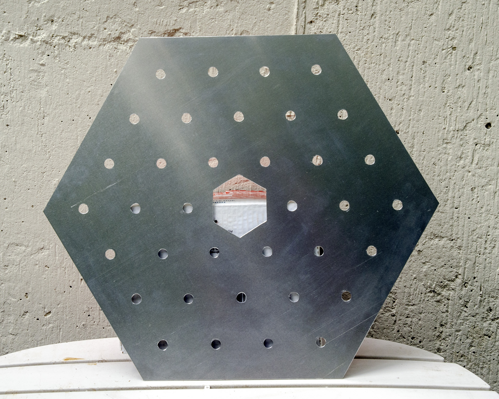
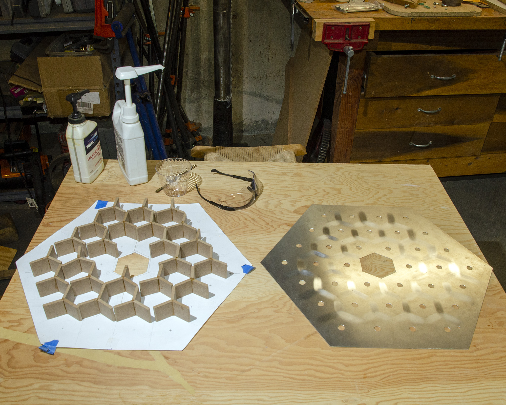
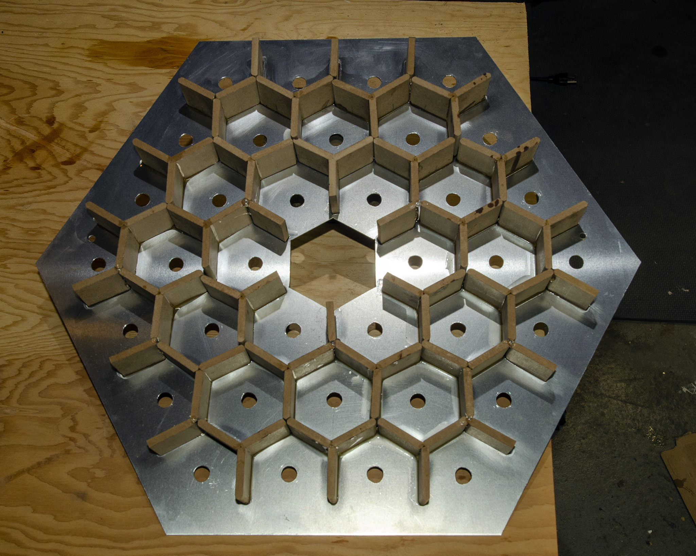
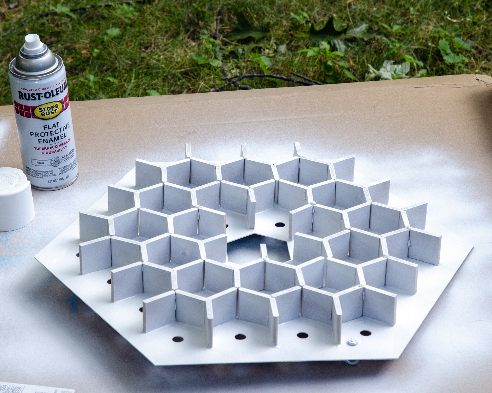
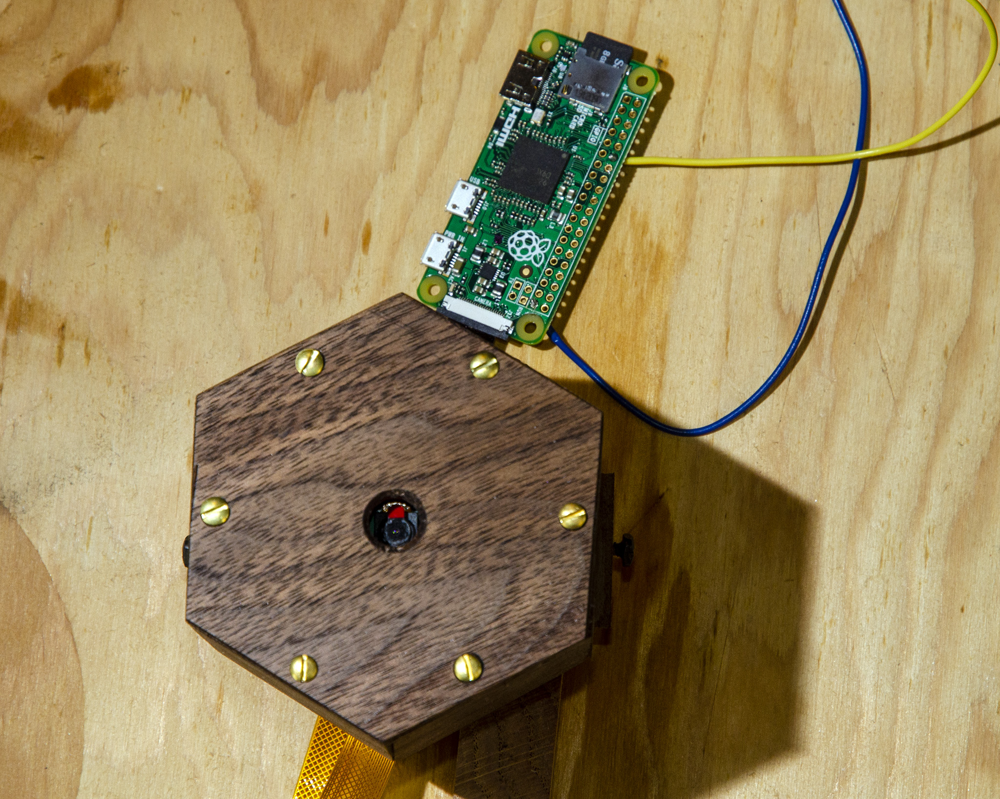

# hexmirror
This is a reactive object built from a camera and 36 LEDs.

## Bill of Materials
* (Raspberry Pi Zero)[https://www.raspberrypi.org/products/raspberry-pi-zero/]
* (Raspberry Pi Camera Module)[https://www.raspberrypi.org/products/camera-module-v2/]
* (string of 36 WS2811 LEDs)[https://www.amazon.com/gp/product/B01AG923GI]
* 1 5V power brick
* 1 sheet 16 ga. aluminum (I used 5052) roughly 2 feet square
* about a foot and a half of 1/4 inch walnut
* about six feet of 1/2 inch walnut
* some 1/4 inch MDF
* a sheet of translucent paper large enough to cover the front (I used mulberry paper)
* wood glue and epoxy

## Build
First, cut the aluminum in the shape shown in [this drawing](images/baseplate.svg). 
I cut it using a router and template. That results in a nice, clean edge, but you need to be careful to do a series of shallow cuts.

The result will look something like this:

Next make up a bunch of Y shapes out of the MDF. Make them about 35mm tall. That's a little smaller than the camera module. This makes the
pixels have a nice soft edge.

Glue those onto the backplate using epoxy.

Use flat white spray paint to paint that white.

I added 2 small eyebolts to the back side at this point. At the end I ran some picture hanging wire between those. That way
this backplate is taking the weight when it hangs on the wall.

In parallel with that, we need to make up this camera module.

Using the 1/4 inch walnut, make six of the [side pieces](images/camera_side.pdf) and one of the front pieces (on the right in [this drawing](images/camera_cover.pdf)).

In addition, you need two copies of the internal pieces shown on the left in [that drawing](images/camera_cover.pdf). Those don't show, so you can use MDF. When you glue
up the camera module, one of these internal pieces will go flush with the back, and the other will be inset from the front far enough to leave room for [the camera](https://projects.raspberrypi.org/en/projects/getting-started-with-picamera).

Once that has dried, mount the camera to the front internal piece and mount the Raspberry Pi to the back of the other. Feed the ribbon cable through the slots.

Then the cover goes over the camera with six #4 brass woodscrews.

Set that into the hexagonal hole in the center of the backplate, and screw a couple of cleats onto the parts that stick through the back to secure it.

Next we need the outer frame. That's six pieces of the 1/2 inch walnut cut to have a slightly smaller diameter than the backplate, with a groove cut into the inside for the backplate to sit in.
The distance between this groove and the front of the side pieces should be the same as the camera module.

Glue those around the outside of the backplate. I built a hexagonal jig for this so I could use wedges to hold the sides at the awkward angles.

Insert the LEDs into the holes in the order specified in the backplate diagram.

## Wiring
The power brick drives both the Raspberry Pi and the LEDs.

I drove the Pi using a USB connector. I believe that with a Zero, you could just solder it to a +5 pin instead. But it was handy during development to be able to swap different versions of the Pi in.
That way I could use one with networking and SSH into it.

So you wire the power brick's +5 to the +5 of the USB and to the +5 of the string of LEDs.

The power brick's ground goes to the Pi's ground and the ground line of the string of LEDs.

Finally, connect the data line of the string of LEDs to the GPIO pin 18 of the Pi.

## Software
The app that runs on the Raspberry Pi and drives the hexmirror.

### Modules used
* [raspicam](https://github.com/cedricve/raspicam) Library for controlling the camera.
* [rpi_ws281x](https://github.com/jgarff/rpi_ws281x) Library for controlling the LEDs using the audio PWM driver.
